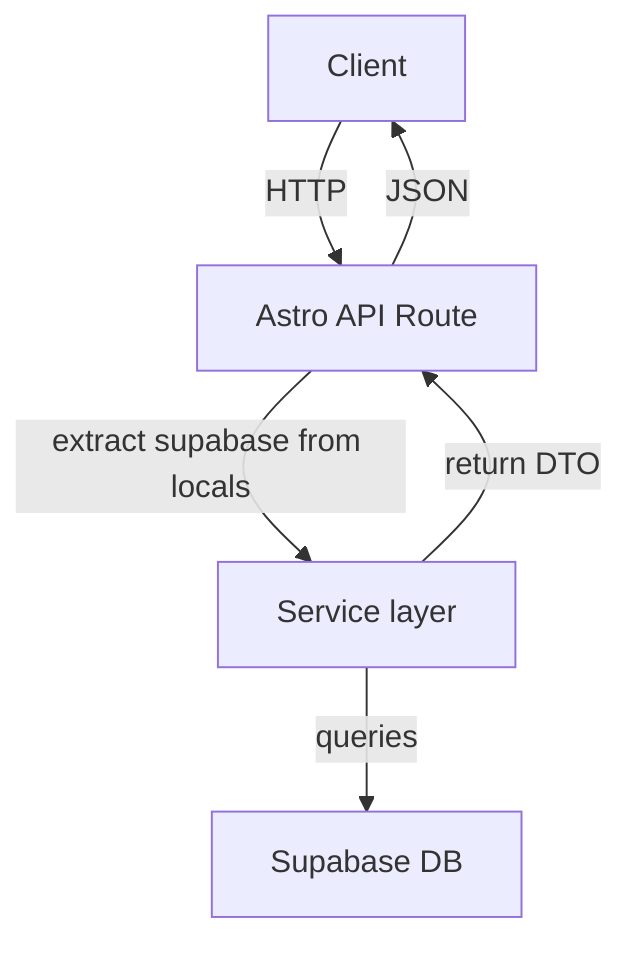

# API Endpoint Implementation Plan: Exercise Sessions (`/api/sessions`)

## 1. Przegląd punktu końcowego

Zestaw trzech powiązanych endpointów REST zarządzających przebiegiem sesji ćwiczeń ("exercise sessions") użytkownika dla zestawu słówek:

1. **POST `/api/sessions`** – rozpoczyna nową sesję ćwiczeń.
2. **GET `/api/sessions/{sessionId}`** – zwraca aktualny stan trwającej lub zakończonej sesji.
3. **PATCH `/api/sessions/{sessionId}/finish`** – kończy aktywną sesję i zapisuje metadane zakończenia.

Każdy endpoint wymaga uwierzytelnionego użytkownika (middleware `authGuard`). Sesje są powiązane z tabelami `exercise_sessions`, `sentences`, `attempts` i `ratings` w bazie danych Supabase.

---

## 2. Szczegóły żądania

### 2.1 POST `/api/sessions`

| Aspekt | Wartość |
|--------|---------|
| Metoda | `POST` |
| Status sukcesu | `201 Created` |
| Body (JSON) | `SessionCreateCommand`  
```json
{
  "set_id": "uuid",
  "generation_id": "uuid", // opcjonalnie, domyślnie ostatnia generacja
  "mode": "translate"
}
``` |
| Header | `Content-Type: application/json` |
| Walidacja | Zod schema `sessionCreateSchema` |

#### Parametry

* **Wymagane**: `set_id (UUID)`, `mode` _(tylko "translate" na MVP)_
* **Opcjonalne**: `generation_id (UUID)` – jeśli pominięte, pobierz najnowszy `generation_runs` dla `set_id`.

---

### 2.2 GET `/api/sessions/{sessionId}`

| Aspekt | Wartość |
|--------|---------|
| Metoda | `GET` |
| Status sukcesu | `200 OK` |
| Parametry ścieżki | `sessionId: UUID` |
| Query | brak |

---

### 2.3 PATCH `/api/sessions/{sessionId}/finish`

| Aspekt | Wartość |
|--------|---------|
| Metoda | `PATCH` |
| Status sukcesu | `200 OK` |
| Parametry ścieżki | `sessionId: UUID` |
| Body (JSON) | `SessionFinishCommand`  
```json
{ "completed_reason": "all_sentences_answered" }
``` |

---

## 3. Wykorzystywane typy

Pochodzące z `src/types.ts`:

* `SessionCreateCommand`
* `SessionCreateResponseDTO`
* `SessionDetailDTO`
* `SessionFinishCommand`
* `SessionFinishResponseDTO`
* `ApiErrorDTO`
* Dodatkowo lokalne schematy Zod dla walidacji (patrz §5).

---

## 4. Szczegóły odpowiedzi

| Endpoint | Kod | DTO | Opis |
|----------|-----|-----|------|
| POST `/api/sessions` | `201` | `SessionCreateResponseDTO` | Nowo utworzona sesja |
| GET `/api/sessions/{id}` | `200` | `SessionDetailDTO` | Aktualny stan sesji |
| PATCH `/finish` | `200` | `SessionFinishResponseDTO` | Potwierdzenie zakończenia |
| *dowolny* | `4xx/5xx` | `ApiErrorDTO` | Ustandaryzowany błąd |

---

## 5. Przepływ danych



### Kroki `POST /sessions`
1. Middleware uwierzytelnia użytkownika i udostępnia `supabase` oraz `user` w `locals`.
2. Walidacja `SessionCreateCommand` (Zod).
3. Service `exerciseSessions.startSession(cmd, user, supabase)`:
   1. Sprawdza brak aktywnej sesji dla użytkownika i `set_id` (`finished_at IS NULL`).
   2. Pobiera/zwaliduje `sets`, `generation_runs` (własność użytkownika).
   3. Tworzy wiersz `exercise_sessions` i generuje zadania dla `sentences`.
4. Zwraca `SessionCreateResponseDTO`.

### Kroki `GET /sessions/{id}`
1. Autoryzacja – sprawdzenie czy sesja należy do użytkownika.
2. Pobranie głównego rekordu + agregaty prób/zdania.
3. Zwrócenie `SessionDetailDTO`.

### Kroki `PATCH /finish`
1. Autoryzacja jak wyżej + upewnienie się, że `finished_at` jest `NULL`.
2. Aktualizacja rekordu i ewentualne emitowanie eventu do `event_log`.

---

## 6. Względy bezpieczeństwa

* **Auth**: Middleware `requireAuth` – brak tokenu ⇒ `401`.
* **Ownership checks**: Każde zapytanie musi weryfikować `user_id` w `sets`, `generation_runs`, `exercise_sessions`.
* **Row-Level Security**: Dodatkowy poziom w Supabase RLS policy.
* **Rate limiting**: Use existing middleware (if any) lub dodać na poziomie CDN.
* **Input tampering**: Zod + UUID regex.

---

## 7. Obsługa błędów

| Kod | Warunek | Wiadomość |
|-----|---------|-----------|
| 400 | Nieprawidłowe lub brakujące pola | `INVALID_PAYLOAD` |
| 401 | Brak/niepoprawny token | `UNAUTHORIZED` |
| 404 | Zasób nie istnieje lub nie należy do usera | `NOT_FOUND` |
| 409 | Istnieje aktywna sesja | `SESSION_ALREADY_RUNNING` |
| 409 | Sesja już zakończona (dla PATCH) | `ALREADY_FINISHED` |
| 500 | Nieoczekiwana awaria | `INTERNAL_SERVER_ERROR` |

Błędy logujemy poprzez `lib/services/log/logError.ts` (do utworzenia) oraz tabelę `error_log` (jeśli istnieje / do dodania w DB).

---

## 8. Rozważania dotyczące wydajności

* **Indeksy**: `exercise_sessions(user_id, finished_at)` przyspieszy wyszukiwanie aktywnej sesji.
* **Joins**: Unikać N+1 – korzystać z `select ... in` oraz `rpc` jeśli potrzebne.
* **DTO trimming**: Wybierać tylko potrzebne kolumny (już enforced przez `Pick` w typach).
* **Caching**: Brak cache dla danych user-specyficznych; można dodać SWR po stronie frontendu.

---

## 9. Etapy wdrożenia

1. **Schema & RLS**
   1. Zweryfikować, że kolumny i klucze obce w `tabelach` odpowiadają planowi DB.
   2. Dodać indeks `exercise_sessions_user_active_idx` (`user_id`, `finished_at`).
   3. Dodać polityki RLS (select/insert/update) dla `exercise_sessions`.
2. **Service layer** – `src/lib/services/sessions`  
   * `startSession.ts` – implementuje logikę tworzenia.  
   * `getSession.ts` – agregaty.  
   * `finishSession.ts` – aktualizacja.
3. **Schemas** – `src/lib/schemas/sessions.ts`  
   * `sessionCreateSchema`, `sessionFinishSchema`, `sessionIdSchema`.
4. **API routes** – `src/pages/api/sessions/`  
   * `index.ts` → `POST` & router.  
   * `[sessionId].ts` → `GET`.  
   * `[sessionId]/finish.ts` → `PATCH`.
5. **Middleware** – upewnić się, że `authGuard` dodaje `user` & `supabase`.
6. **Error handling util** (`src/lib/utils.ts`) – `toApiError()` dla mapowania błędów service → DTO.
